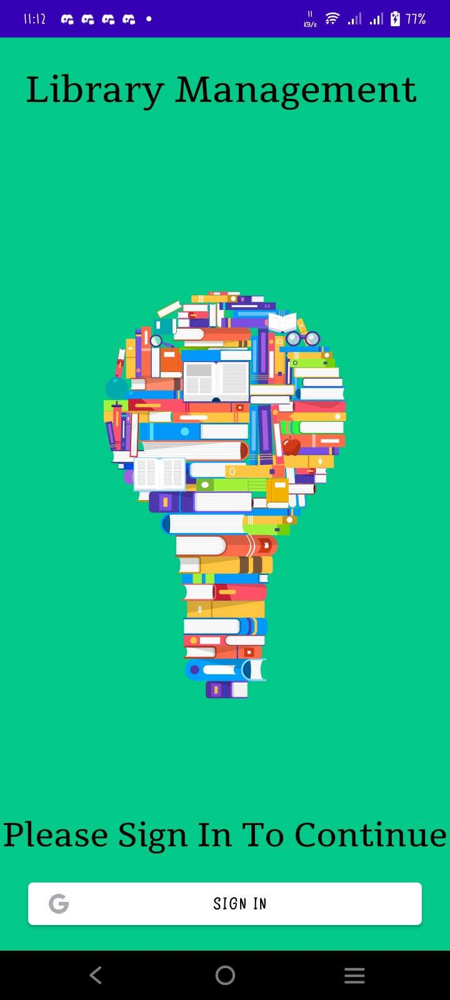
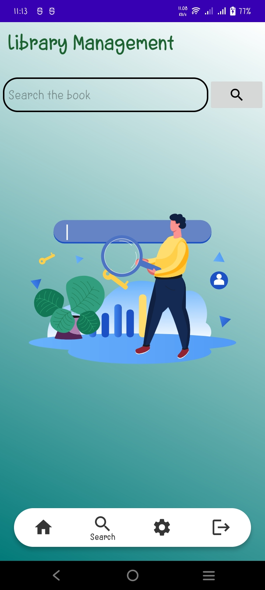
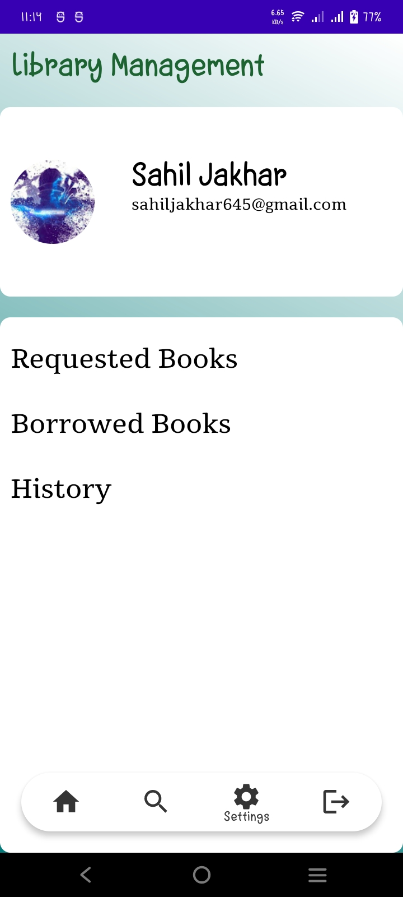
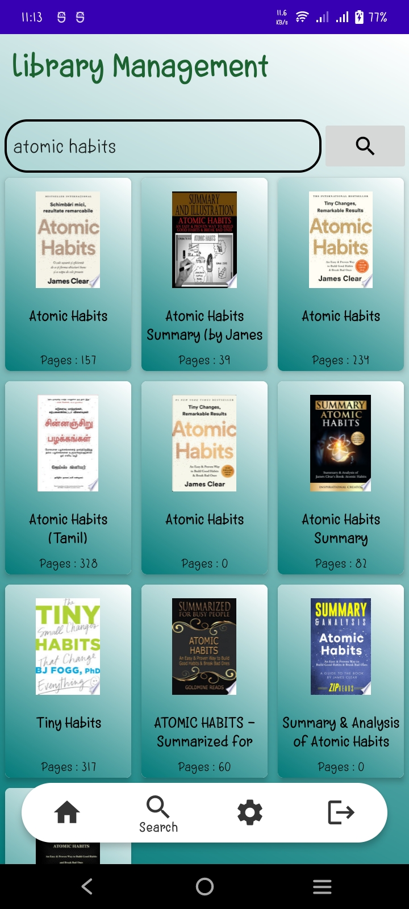

# Library Management System - User App 📚

## Overview
The **Library Management System - User App** is a mobile application designed to help students access and manage library resources conveniently. It provides an integrated platform for discovering digital books using the Google Books API and borrowing physical books from the college library. The app ensures real-time updates and secure data handling through Firebase Firestore.

---

## Features
- **Online Reading:** Access a vast collection of digital books via the Google Books API.
- **Book Borrowing:** Explore a curated list of physical books available in the college library.
- **Dynamic Search:** Quickly find books using an intuitive search functionality.
- **Real-Time Updates:** Ensure seamless data synchronization powered by Firebase Firestore.
- **User-Friendly Interface:** Navigate easily with a clean and responsive UI.

---

## Technologies Used
- **Kotlin**: Primary programming language for app development.
- **Google Books API**: Integration for accessing and reading digital books.
- **Firebase Firestore**: Real-time database for secure and synchronized data storage.
- **XML**: For designing the app's UI.

---

## Screenshots

### Login Screen


### Book Search


### Book Details


### Profile Page


### Search Books


### Result of Search


### Result Details


---

## How to Use
1. **Download the App**: Clone the repository and install the app on your Android device.
2. **Sign In**: Use your Google account to log in securely.
3. **Browse Books**: Explore digital books and physical library collections.
4. **Borrow Books**: Add physical books to your borrowing list and track them.

---

## Installation
Step 1. Clone this repository:
    ```bash
   	git clone https://github.com/your-username/library-management-user-app.git


Step 2: Open the project in Android Studio

Step 3: Set up Firebase for the project
- Go to the Firebase Console (https://console.firebase.google.com/) and create a new project.
- Enable Realtime Database and Google Authentication under the Authentication section.
- Add your app's SHA-1 and SHA-256 keys from your local development environment:
- In Android Studio, navigate to Gradle > Tasks > android > signingReport to find your SHA keys.
 - Copy the keys and add them to your Firebase project under Project Settings > Add Fingerprint.

Step 4: Download the google-services.json file from Firebase
- Replace the existing google-services.json file in the app/ directory of the project with the one you just downloaded.

Step 5: Build and run the project
- Sync the project with Gradle files in Android Studio.
- Connect your Android device or emulator and run the app.

